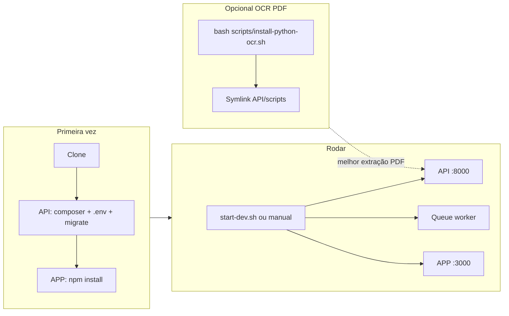

# Sistema de Controle Financeiro

Sistema completo de controle financeiro desenvolvido com Vue.js 3 (front-end) e Laravel (back-end).

## Estrutura do Projeto

- **API**: Back-end Laravel com PostgreSQL
- **APP**: Front-end Vue.js 3 com TypeScript

## Funcionalidades

- ✅ Autenticação de usuários (login/registro)
- ✅ Gerenciamento de categorias (receitas/despesas)
- ✅ CRUD completo de transações financeiras
- ✅ Dashboard com resumo financeiro
- ✅ Sistema de orçamentos e metas
- ✅ Relatórios e filtros avançados
- ✅ Interface moderna e responsiva
- ✅ Importação de faturas de cartão de crédito (PDF/CSV)
- ✅ Categorização automática por palavras-chave

## Tecnologias

### Back-end (API)
- Laravel 12
- Laravel Sanctum (autenticação)
- PostgreSQL
- Eloquent ORM

### Front-end (APP)
- Vue.js 3 (Composition API)
- TypeScript
- Vue Router
- Pinia (gerenciamento de estado)
- Axios
- Tailwind CSS
- Chart.js (gráficos)

## Pré-requisitos

- **PHP 8.3+** e **Composer**
- **Node.js 18+** e **npm**
- **PostgreSQL 12+** (ou SQLite para testes rápidos)
- **Opcional** (para importação de faturas em PDF com OCR): Python 3.8+, Tesseract OCR, poppler-utils

## Como rodar o projeto

**Opção A – Um comando (após a primeira configuração):**

Na raiz do projeto, execute o script correspondente ao seu sistema:

```bash
# Linux / macOS
./start-dev.sh
```

```powershell
# Windows
.\start-dev.ps1
```

Isso sobe a API (porta 8000), o worker de filas e o APP (porta 3000). Na primeira vez, configure antes a API e o APP conforme a Opção B.

> **Windows:** use o `start-dev.ps1`, não o `start-dev.sh`. O script `.sh` depende de gerenciamento de processos POSIX (`pkill -P`, `kill -0`) que não funciona no Git Bash: ao encerrar, ele mata o processo do `npm` mas deixa o `vite` vivo segurando a porta 3000, e anuncia que parou tudo. O `start-dev.ps1` coleta a árvore de processos completa antes de encerrar e derruba todos os descendentes.

**Opção B – Passo a passo manual:**

1. **Back-end:** entre em `API`, instale dependências, copie e configure o `.env`, rode as migrations e o worker de filas (detalhes abaixo).
2. **Front-end:** entre em `APP`, execute `npm install` e `npm run dev`.
3. Acesse o APP em `http://localhost:3000` e a API em `http://localhost:8000`.

Ordem recomendada na primeira vez: configurar a API (env, migrate, filas) e o APP (`npm install`) antes de usar o `start-dev.sh`.



## Instalação

### Back-end (API)

```bash
cd API
composer install
cp .env.example .env
php artisan key:generate
```

Configure o arquivo `.env` com suas credenciais do PostgreSQL:

```env
DB_CONNECTION=pgsql
DB_HOST=127.0.0.1
DB_PORT=5432
DB_DATABASE=controle_financeiro
DB_USERNAME=postgres
DB_PASSWORD=sua_senha
```

**Importante:** Antes de executar as migrations, você precisa instalar e configurar o PostgreSQL:

1. Instalar o PostgreSQL:
   ```bash
   sudo apt-get update
   sudo apt-get install postgresql postgresql-contrib
   ```

2. Iniciar o serviço PostgreSQL:
   ```bash
   sudo systemctl start postgresql
   sudo systemctl enable postgresql  # Para iniciar automaticamente
   ```

3. Criar o banco de dados:
   ```bash
   sudo -u postgres psql
   ```
   
   Dentro do psql, execute:
   ```sql
   CREATE DATABASE controle_financeiro;
   CREATE USER seu_usuario WITH PASSWORD 'sua_senha';
   GRANT ALL PRIVILEGES ON DATABASE controle_financeiro TO seu_usuario;
   \q
   ```

4. Atualize o arquivo `.env` com as credenciais criadas.

**Alternativa rápida (SQLite):** Se preferir usar SQLite temporariamente para testes:
```bash
sudo apt-get install php8.3-sqlite3
cd API
sed -i 's/DB_CONNECTION=pgsql/DB_CONNECTION=sqlite/' .env
sed -i '/^DB_HOST=/d; /^DB_PORT=/d; /^DB_DATABASE=/d; /^DB_USERNAME=/d; /^DB_PASSWORD=/d' .env
echo "DB_DATABASE=$(pwd)/database/database.sqlite" >> .env
touch database/database.sqlite
php artisan migrate
```

Execute as migrations:

```bash
php artisan migrate
```

**Configuração de Filas (Obrigatório para importação de faturas):**

O sistema de importação de faturas utiliza filas do Laravel para processar arquivos em background. Configure o arquivo `.env`:

```env
QUEUE_CONNECTION=database
```

Execute o worker de filas em um terminal separado:

```bash
php artisan queue:work
```

**Importante:** O worker de filas deve estar rodando para que as importações de faturas funcionem. Em produção, recomenda-se usar um supervisor como o Supervisor do Linux para manter o worker sempre ativo.

Inicie o servidor:

```bash
php artisan serve
```

### Front-end (APP)

```bash
cd APP
npm install
npm run dev
```

O front-end estará disponível em `http://localhost:3000` e o back-end em `http://localhost:8000`.

### Python / OCR (opcional)

Para melhor precisão na importação de faturas em PDF (ex.: Mercado Pago), o sistema pode usar OCR via script Python e Tesseract. Sem isso, são usados pdftotext ou fallback em PHP.

**Instalação:**

```bash
bash scripts/install-python-ocr.sh
```

O script instala Tesseract OCR (com idioma português), poppler-utils, cria o ambiente virtual em `scripts/venv` e instala as dependências de [scripts/requirements.txt](scripts/requirements.txt).

**Symlink para a API:** O Laravel espera os scripts em `API/scripts/`. Como eles ficam na raiz em `scripts/`, crie o symlink a partir da raiz do projeto:

```bash
cd API && ln -s ../scripts scripts && cd ..
```

Para mais detalhes e uso manual do script, veja [scripts/README.md](scripts/README.md).

## Uso

1. Acesse `http://localhost:3000`
2. Crie uma conta ou faça login
3. Comece criando categorias
4. Adicione palavras-chave nas categorias para categorização automática (ex: categoria "Alimentação" com keywords ["burguer", "restaurante", "comida"])
5. Adicione suas transações financeiras manualmente ou importe faturas de cartão
6. Configure orçamentos e acompanhe seus gastos

### Importação de Faturas

O sistema suporta importação de faturas de cartão de crédito nos seguintes formatos:

- **CSV (Nubank)**: Arquivo CSV exportado do Nubank
- **PDF (Mercado Pago)**: Fatura em PDF do Mercado Pago com tabela "Movimentações"

**Como usar:**

1. Acesse a página de Transações
2. Clique em "Importar Fatura"
3. Selecione o arquivo PDF ou CSV
4. O sistema processará o arquivo em background
5. Transações serão criadas automaticamente
6. Transações que não puderam ser categorizadas automaticamente aparecerão na seção "Transações Pendentes"
7. Categorize manualmente as transações pendentes selecionando a categoria apropriada

**Categorização Automática:**

Para que o sistema categorize automaticamente as transações, adicione palavras-chave nas categorias:

1. Edite uma categoria
2. Adicione palavras-chave relacionadas (ex: para "Alimentação", adicione: "burguer", "restaurante", "comida", "lanche")
3. Ao importar faturas, transações com essas palavras na descrição serão automaticamente categorizadas

**Categorização com IA:**

Na seção "Transações Pendentes" há o botão **✨ Sugerir com IA**, que analisa as descrições
das transações e sugere uma categoria para cada uma, entre as categorias que você já criou.

- As transações que já casam com alguma palavra-chave são resolvidas localmente, sem custo de IA.
- Cada sugestão vem com o nível de confiança e uma justificativa curta.
- Sugestões acima da confiança mínima (`AI_CATEGORIZATION_MIN_CONFIDENCE`, padrão 70%) podem ser
  aplicadas de uma vez; as demais ficam pré-selecionadas para você revisar antes de confirmar.
- Ao aplicar, as palavras-chave extraídas são guardadas na categoria, então transações parecidas
  passam a ser categorizadas sem chamar a IA novamente.
- A análise roda em lotes de `AI_CATEGORIZATION_BATCH_SIZE` transações (padrão 40).

Configuração em `API/.env`:

```env
AI_CATEGORIZATION_PROVIDER=openai
AI_CATEGORIZATION_MODEL=gpt-5.6-luna
AI_CATEGORIZATION_REASONING_EFFORT=low
AI_CATEGORIZATION_TIMEOUT=120
AI_CATEGORIZATION_BATCH_SIZE=40
AI_CATEGORIZATION_MIN_CONFIDENCE=0.7
```

## Estrutura de Pastas

### API (Laravel)
```
API/
├── app/
│   ├── Http/
│   │   └── Controllers/
│   └── Models/
├── database/
│   └── migrations/
└── routes/
    └── api.php
```

### APP (Vue.js)
```
APP/
├── src/
│   ├── components/
│   ├── views/
│   ├── stores/
│   ├── services/
│   ├── router/
│   └── assets/
```

## API Endpoints

### Autenticação
- `POST /api/auth/register` - Registrar novo usuário
- `POST /api/auth/login` - Login
- `POST /api/auth/logout` - Logout
- `GET /api/auth/user` - Obter usuário autenticado

### Categorias
- `GET /api/categories` - Listar categorias
- `POST /api/categories` - Criar categoria
- `GET /api/categories/{id}` - Obter categoria
- `PUT /api/categories/{id}` - Atualizar categoria
- `DELETE /api/categories/{id}` - Excluir categoria

### Transações
- `GET /api/transactions` - Listar transações (com filtros)
- `POST /api/transactions` - Criar transação
- `GET /api/transactions/{id}` - Obter transação
- `PUT /api/transactions/{id}` - Atualizar transação
- `DELETE /api/transactions/{id}` - Excluir transação
- `POST /api/transactions/ai-suggestions` - Sugerir categorias com IA para transações pendentes
- `POST /api/transactions/ai-suggestions/apply` - Aplicar as sugestões confirmadas

### Dashboard
- `GET /api/dashboard` - Obter dados do dashboard

### Orçamentos
- `GET /api/budgets` - Listar orçamentos
- `POST /api/budgets` - Criar orçamento
- `PUT /api/budgets/{id}` - Atualizar orçamento
- `DELETE /api/budgets/{id}` - Excluir orçamento

### Importação de Faturas
- `POST /api/invoice-import/upload` - Upload de arquivo de fatura (PDF/CSV)
- `GET /api/invoice-import/pending` - Listar transações pendentes de categorização
- `PUT /api/invoice-import/transactions/{id}/categorize` - Categorizar transação pendente

## Desenvolvimento

Para desenvolvimento, certifique-se de ter:

- PHP 8.3+
- Composer
- Node.js 18+
- PostgreSQL 12+

Opcional (importação de PDF com OCR):

- Python 3.8+
- Tesseract OCR (com idioma português)

## Licença

Este projeto é de código aberto.

